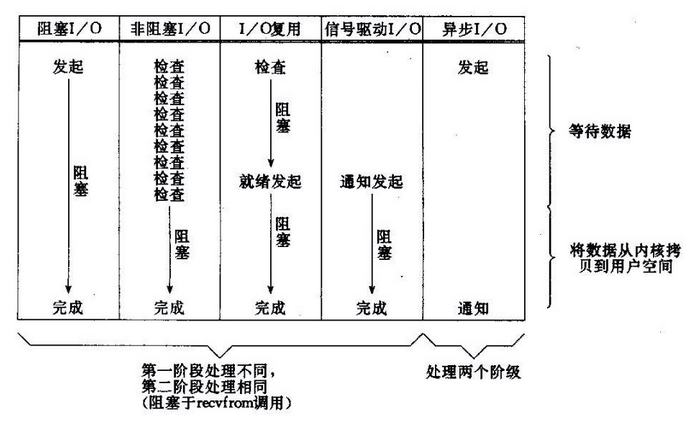

NIO（Non-blocking I/O，在Java领域，也称为New I/O），是一种同步非阻塞的I/O模型，也是I/O多路复用的基础，已经被越来越多地应用到大型应用服务器，成为解决高并发与大量连接、I/O处理问题的有效方式。

## NIO实例

服务端
```
import java.io.IOException;
import java.net.InetSocketAddress;
import java.nio.channels.SelectionKey;
import java.nio.channels.Selector;
import java.nio.channels.ServerSocketChannel;
import java.util.Iterator;
 
public class TCPServer {
    //缓冲区的长度
    private static final int BUF_SIZE = 256;
    //select方法等待信道准备好的最长时间
    private static final int TIMEOUT = 3000;

    public static void main(String[] args) throws IOException {

        //创建一个选择器
        Selector selector = Selector.open();

        //实例化一个信道
        ServerSocketChannel listenChannel = ServerSocketChannel.open();
        //将该信道绑定到指定端口
        listenChannel.socket().bind(new InetSocketAddress(8881));
        //配置信道为非阻塞模式
        listenChannel.configureBlocking(false);
        //将选择器注册到各个信道
        listenChannel.register(selector, SelectionKey.OP_ACCEPT);

        //创建一个实现了协议接口的对象
        EchoProtocol protocol = new EchoProtocol(BUF_SIZE);
        //不断轮询select方法，获取准备好的信道所关联的Key集
        while (true){
            //一直等待,直至有信道准备好了I/O操作
            if (selector.select(TIMEOUT) == 0){
                //在等待信道准备的同时，也可以异步地执行其他任务，
                //这里只是简单地打印"."
                System.out.print(".");
                continue;
            }
            //获取准备好的信道所关联的Key集合的iterator实例
            Iterator<SelectionKey> keyIter = selector.selectedKeys().iterator();
            //循环取得集合中的每个键值
            while (keyIter.hasNext()){
                SelectionKey key = keyIter.next();
                //如果服务端信道感兴趣的I/O操作为accept
                if (key.isAcceptable()){
                    protocol.handleAccept(key);
                }
                //如果客户端信道感兴趣的I/O操作为read
                if (key.isReadable()){
                    protocol.handleRead(key);
                }
                //如果该键值有效，并且其对应的客户端信道感兴趣的I/O操作为write
                if (key.isValid() && key.isWritable()) {
                    protocol.handleWrite(key);
                }
                //这里需要手动从键集中移除当前的key
                keyIter.remove();
            }
        }
    }
}
```
实例简单的echo服务
```
import java.io.IOException;
import java.nio.ByteBuffer;
import java.nio.channels.SelectionKey;
import java.nio.channels.ServerSocketChannel;
import java.nio.channels.SocketChannel;

public class EchoProtocol  {
    private int bufSize; // 缓冲区的长度
    public EchoProtocol(int bufSize){
        this.bufSize = bufSize;
    }

    //服务端信道已经准备好了接收新的客户端连接
    public void handleAccept(SelectionKey key) throws IOException {
        SocketChannel clientChannel = ((ServerSocketChannel) key.channel()).accept();
        clientChannel.configureBlocking(false);
        //将选择器注册到连接到的客户端信道，并指定该信道key值的属性为OP_READ，同时为该信道指定关联的附件
        clientChannel.register(key.selector(), SelectionKey.OP_READ, ByteBuffer.allocate(bufSize));
    }

    //客户端信道已经准备好了从信道中读取数据到缓冲区
    public void handleRead(SelectionKey key) throws IOException{
        SocketChannel clientChannel = (SocketChannel) key.channel();
        //获取该信道所关联的附件，这里为缓冲区
        ByteBuffer buf = (ByteBuffer) key.attachment();
        long bytesRead = clientChannel.read(buf);
        //如果read（）方法返回-1，说明客户端关闭了连接，那么客户端已经接收到了与自己发送字节数相等的数据，可以安全地关闭
        if (bytesRead == -1){
            clientChannel.close();
        }else if(bytesRead > 0){
            //如果缓冲区总读入了数据，则将该信道感兴趣的操作设置为为可读可写
            key.interestOps(SelectionKey.OP_READ | SelectionKey.OP_WRITE);
        }
    }

    //客户端信道已经准备好了将数据从缓冲区写入信道
    public void handleWrite(SelectionKey key) throws IOException {
        //获取与该信道关联的缓冲区，里面有之前读取到的数据
        ByteBuffer buf = (ByteBuffer) key.attachment();
        //重置缓冲区，准备将数据写入信道
        buf.flip();
        SocketChannel clientChannel = (SocketChannel) key.channel();
        //将数据写入到信道中
        clientChannel.write(buf);
        if (!buf.hasRemaining()){
            //如果缓冲区中的数据已经全部写入了信道，则将该信道感兴趣的操作设置为可读
            key.interestOps(SelectionKey.OP_READ);
        }
        //为读入更多的数据腾出空间
        buf.compact();
    }
}
```

客户端
```
import java.net.InetSocketAddress;
import java.net.SocketException;
import java.nio.ByteBuffer;
import java.nio.channels.SocketChannel;

public class TCPClient {
    public static void main(String args[]) throws Exception{
        String server = "127.0.0.1";
        int serverPort = 8881;
        byte[] sendBytes = "hello".getBytes();

        //创建一个信道，并设为非阻塞模式
        SocketChannel clientChannel = SocketChannel.open();
        clientChannel.configureBlocking(false);
        //向服务端发起连接
        if (!clientChannel.connect(new InetSocketAddress(server, serverPort))){
            //不断地轮询连接状态，直到完成连接
            while (!clientChannel.finishConnect()){
                //在等待连接的时间里，可以执行其他任务，以充分发挥非阻塞IO的异步特性
                //这里为了演示该方法的使用，只是一直打印"."
                System.out.print(".");
            }
        }
        //为了与后面打印的"."区别开来，这里输出换行符
        System.out.print("\n");
        //分别实例化用来读写的缓冲区
        ByteBuffer writeBuf = ByteBuffer.wrap(sendBytes);
        ByteBuffer readBuf = ByteBuffer.allocate(sendBytes.length);
        //接收到的总的字节数
        int totalBytesReceived = 0;
        //每一次调用read（）方法接收到的字节数
        int bytesReceived;
        //循环执行，直到接收到的字节数与发送的字符串的字节数相等
        while (totalBytesReceived < sendBytes.length){
            //如果用来向通道中写数据的缓冲区中还有剩余的字节，则继续将数据写入信道
            if (writeBuf.hasRemaining()){
                clientChannel.write(writeBuf);
            }
            //如果read（）接收到-1，表明服务端关闭，抛出异常
            if ((bytesReceived = clientChannel.read(readBuf)) == -1){
                throw new SocketException("Connection closed prematurely");
            }
            //计算接收到的总字节数
            totalBytesReceived += bytesReceived;
            //在等待通信完成的过程中，程序可以执行其他任务，以体现非阻塞IO的异步特性
            //这里为了演示该方法的使用，同样只是一直打印"."
            System.out.print(".");
        }
        //打印出接收到的数据
        System.out.println("Received: " +  new String(readBuf.array(), 0, totalBytesReceived));
        //关闭信道
        clientChannel.close();
    }
}
```

NIO
下图是几种常见I/O模型的对比：  
  
所有的系统I/O都分为两个阶段：等待就绪和操作。举例来说，读函数，分为等待系统可读和真正的读；同理，写函数分为等待网卡可以写和真正的写。

需要说明的是等待就绪的阻塞是不使用CPU的，是在“空等”；而真正的读写操作的阻塞是使用CPU的，真正在"干活"，而且这个过程非常快，属于memory copy，带宽通常在1GB/s级别以上，可以理解为基本不耗时。  
以socket.read()为例子：

传统的BIO里面socket.read()，如果TCP RecvBuffer里没有数据，函数会一直阻塞，直到收到数据，返回读到的数据。

对于NIO，如果TCP RecvBuffer有数据，就把数据从网卡读到内存，并且返回给用户；反之则直接返回0，永远不会阻塞。当数据准备好时，系统将通过应用程序进行处理。


最新的AIO(Async I/O)里面会更进一步：不但等待就绪是非阻塞的，就连数据从网卡到内存的过程也是异步的。

select，poll，epoll本质上都是同步I/O，因为他们都需要在读写事件就绪后自己负责进行读写，也就是说这个读写过程是阻塞的，而异步I/O则无需自己负责进行读写，异步I/O的实现会负责把数据从内核拷贝到用户空间。

Reactor模式

reactor是事件通知机制，与nio非常符合。与atm类似

上例中存在一些问题，如
cpu处理和io等待在同一线程，CPU的处理速度是要远远快于IO速度的，如果CPU为了IO操作（例如从Socket读取一段数据）而阻塞显然是不划算的。
对于不同的请求类型，需要联系上下文（如user查询请求需要user连接，product请求product连接），再使用read、write这样的网络IO获取此次的操作内容，结合上下文状态查询此时应当选择哪个业务方法处理，随着请求类型的增加，请求状态的增加，请求命令的增加，主程序复杂度快速膨胀，导致维护越来越困难


这时先驱们找到了事件驱动，或者叫回调的方式，来完成这件事情。这种方式就是，应用业务向一个中间人注册一个回调（event handler），当IO就绪后，就这个中间人产生一个事件，并通知此handler进行处理。这种回调的方式，也体现了“好莱坞原则”（Hollywood principle）-“Don't call us, we'll call you”，在我们熟悉的IoC中也有用到。看来软件开发真是互通的！

好了，我们现在来看Reactor模式。在前面事件驱动的例子里有个问题：我们如何知道IO就绪这个事件，谁来充当这个中间人？Reactor模式的答案是：由一个不断等待和循环的单独进程（线程）来做这件事，它接受所有handler的注册，并负责先操作系统查询IO是否就绪，在就绪后就调用指定handler进行处理，这个角色的名字就叫做Reactor。

reactor
```
import java.io.IOException;
import java.net.InetSocketAddress;
import java.nio.channels.SelectionKey;
import java.nio.channels.Selector;
import java.nio.channels.ServerSocketChannel;
import java.nio.channels.SocketChannel;
import java.util.Iterator;
import java.util.Set;

public class Reactor implements Runnable{
    final Selector selector;
    final ServerSocketChannel serverSocket;

    public static void main(String[] args) throws IOException {
        Reactor reactor = new Reactor(8881);
        new Thread(reactor).start();
        System.out.println("server start...");
    }

    Reactor(int port) throws IOException {
        selector = Selector.open();
        serverSocket = ServerSocketChannel.open();
        serverSocket.socket().bind(new InetSocketAddress(port));
        serverSocket.configureBlocking(false);
        SelectionKey sk = serverSocket.register(selector, SelectionKey.OP_ACCEPT);
        sk.attach(new Acceptor());
    }

    public void run() {  // normally in a new Thread
        try {
            while (!Thread.interrupted()) {
                selector.select();
                Set selected = selector.selectedKeys();
                Iterator it = selected.iterator();
                while (it.hasNext())
                    dispatch((SelectionKey)(it.next()));
                selected.clear();
            }
        } catch (IOException ex) { ex.printStackTrace(); }
    }

    void dispatch(SelectionKey k) {
        Runnable r = (Runnable)(k.attachment());
        if (r != null)
            r.run();
    }

    class  Acceptor  implements Runnable {
        public void run() {
            try {
                SocketChannel c = serverSocket.accept();
                if (c != null)
                    new Handler(selector, c);
            }
            catch(IOException ex) { ex.printStackTrace(); }
        }
    }
}
```

Handler
```
import java.io.IOException;
import java.nio.ByteBuffer;
import java.nio.channels.SelectionKey;
import java.nio.channels.Selector;
import java.nio.channels.SocketChannel;

public class Handler implements Runnable {
    private static  final  int MAXIN = 1024;

    final SocketChannel socket;
    final SelectionKey sk;
    ByteBuffer input = ByteBuffer.allocate(MAXIN);

    static final int READING = 0, SENDING = 1;
    int state = READING;

    Handler(Selector sel , SocketChannel c) throws IOException {
        socket = c; c.configureBlocking(false);
        // Optionally try first read now
        sk = socket.register(sel, 0);
        sk.interestOps(SelectionKey.OP_READ);

        sk.attach(this);
        sel.wakeup();
    }

    boolean inputIsComplete()  {  return true; }
    boolean outputIsComplete() {  return true; }
    void process()             { /* ... */
        input.flip();
    }

    // class Handler continued
    public void run() {
        try {
            if (state == READING)
                read();
            else if (state == SENDING)
                send();
        } catch (IOException ex) { ex.printStackTrace(); }
    }

    void read() throws IOException {
        socket.read(input);
        if (inputIsComplete()) {
            process();
            state = SENDING ;
            // Normally also do first write now
            sk.interestOps(SelectionKey.OP_WRITE);
        }
    }
    void send() throws IOException {
        socket.write(input);
        if (outputIsComplete())
            sk.cancel();
    }
}
```

参考：  
[Linux IO模式及 select、poll、epoll详解](https://segmentfault.com/a/1190000003063859)  
[Java NIO浅析](http://tech.meituan.com/nio.html)
