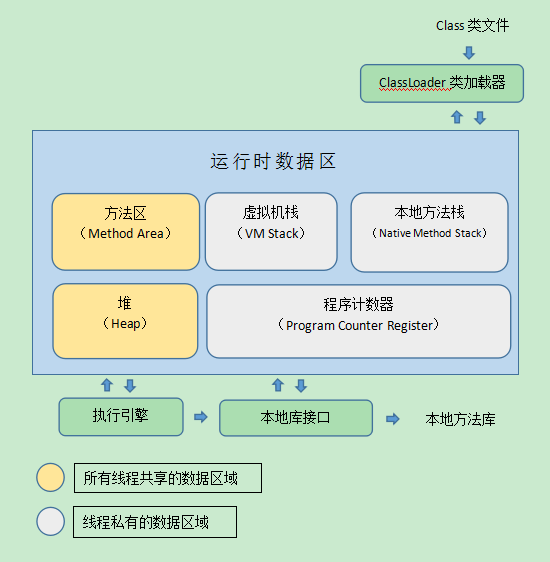
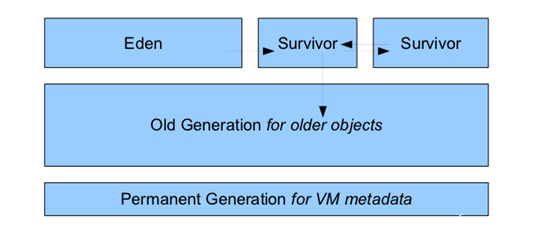
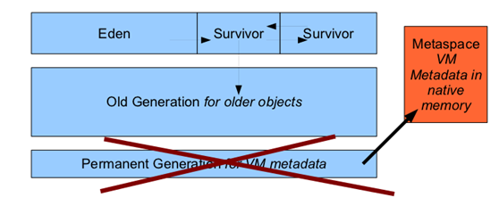

### 运行时数据区域
java虚拟机在执行java程序的过程中会把它管理的内存划分为若干不同的数据区域。这些区域都有各自的用途，以及创建和销毁时间。有的区域随着虚拟机启动而存在，有些区域则依赖用户线程的启动和结束而建立和销毁。  



#### 程序计数器
每一条java虚拟机线程都有自己的pc寄存器。
如果当前方法不是Native方法，pc寄存器会保存虚拟机正在执行的字节码指令的地址;如果当前方法是Native方法，则pc寄存器的值为undefined。

此区域任何情况都不能导致OutOfMemoryError情况的区域  

#### Java虚拟机栈

线程私有,生命周期与线程相同.

每个方法在执行的同时都会创建一个栈帧用于存储局部变量表, 操作数栈, 动态链接, 方法出口等信息.每一个方法从调用直至执行完成的过程, 都对应一个栈帧在虚拟机栈中入栈到出栈的过程.

如果线程请求的栈深度大于虚拟机所允许的深度, 将抛出StackOverflowError异常.

如果虚拟机栈可以动态扩展, 但如果扩展时无法申请到足够的内存,或者在创建新的线程时没有足够的内存去创建对应的虚拟机栈帧，
则抛出OutOfMemoryError异常.

-Xss参数可以设定栈容量。

```
/**
 * VM Args : -Xss128k
 */
public class JavaVMStackSOF {
	private int stackLength = 1;
	
	public void stackLeak() {
		stackLength++;
		stackLeak();
	}
	
	public static void main(String[] args) {
		JavaVMStackSOF oom = new JavaVMStackSOF();
		try {
			oom.stackLeak();
		} catch (Throwable e) {
			System.out.println("stack length : " + oom.stackLength);
			e.printStackTrace();
		}
	}
}
```
`stackLeak()`方法不断调用自身，导致虚拟机栈溢出，抛出异常`java.lang.StackOverflowError`


```
public class JavaVmStackOOM {
	public void stackLeakByThead() {
		while(true) {	// 不断创建新的线程
			Thread thread = new Thread(new Runnable() {
				public void run() {
					while(true) {	// 阻止线程结束
					}
				}
			});
			thread.start();
		}
	}

	public static void main(String[] args) {
		try {
			JavaVmStackOOM oom = new JavaVmStackOOM();
			oom.stackLeakByThead();
		} catch (Throwable e) {
			e.printStackTrace();
		}
	}
}
```
程序不断地创建新的线程，导致虚拟机栈内存溢出。  
输出异常信息（程序可能造成系统假死）`java.lang.OutOfMemoryError: unable to create new native thread`

#### 本地方法栈

与虚拟机栈相似, 但它为虚拟机用到的Native方法服务.

同样抛出StackOverflowError异常和OutOfMemoryError异常.

本地方法无法设定（-Xoss无效）

	
#### Java堆
用于存放对象实例，所有线程共享  
所有对象实例和数组都要在堆上分配.(栈上分配, 标量替换等优化技术除外)  
可以处于物理上不连续的内存空间, 只要逻辑上是连续的即可.

-Xms128m JVM初始分配的堆内存  
-Xmx512m JVM最大允许分配的堆内存，可按需扩展  

~~~java
/**
 * VM Args : -Xms10m -Xmx10m -XX:+HeapDumpOnOutOfMemoryError
 */
public class HeapOOM {
	public static void main(String[] args) {
		List<Object> list = new ArrayList<Object>();
		while(true) {
			list.add(new Object());
		}
	}
}
~~~
`list`不断存入创建的Object对象，导致Java堆内存不足，抛出`java.lang.OutOfMemoryError: Java heap space`异常。


#### 方法区
用于存储已被虚拟机加载的类信息，常量，静态变量，即时编译器编译后的代码等数据。

线程共享

当方法区无法满足内存分配需求时, 将抛出OutOfMemoryError异常.

也可以处于物理上不连续的内存空间.

常被称为“永久代”，实际上Full GC会进行持久代的回收。

MaxPermSize可以上限（jdk后失效）

##### 运行时常量池
运行时常量池是方法区的一部分，用于存储编译期生成的各种字面量和符号引用。

jdk6:


jdk8:

Jdk8 中方法区被删除，直接使用本地内存来表示类的元数据，这个区域就叫做元空间。
JVM会忽略PermSize和MaxPermSize这两个参数，也不会出现java.lang.OutOfMemoryError: PermGen error的异常了。  
[Java 8的元空间](http://it.deepinmind.com/gc/2014/05/14/metaspace-in-java-8.html)


#### 直接内存
直接内存不属于虚拟机运行时数据，也不是Java虚拟机规范中定义的内存区域。  
但可以通过NIO（DirectByteBuffer）操作直接内存，从而避免在Java堆和Native堆中复制数据。也可能导致DirectByteBuffer异常出现。  
直接内存的分配不受Java堆大小的限制，但会受到本机总内存大小及处理器寻址空间的限制。

参考：  
[深入理解Java虚拟机（第2版）](https://book.douban.com/subject/24722612/)  
[Java - 虚拟机学习笔记1 自动内存管理机制](http://www.jianshu.com/p/2f2f03d29de5)


http://www.codeceo.com/article/java-memory-area.html